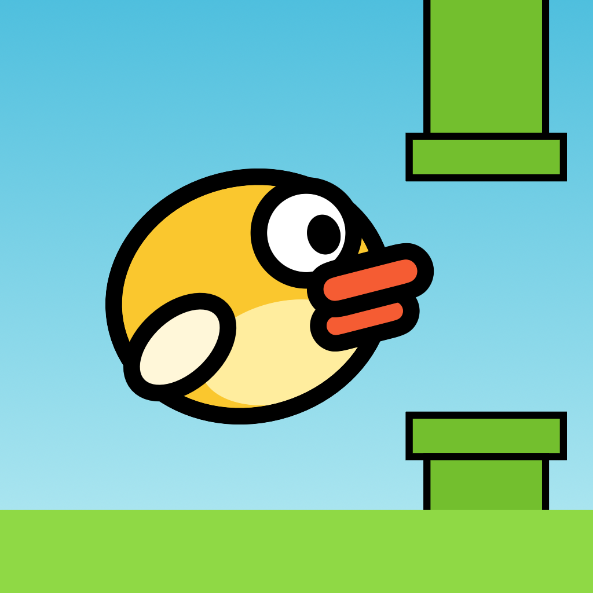

<p align="center">
  
</p>

<h1 align="center">DuoBird</h1>

<p align="center">
  Flappy Bird for the foldable <b>iPhone Duo</b>. Snap the hinge open to flap.
</p>

<p align="center">
  
  
  
  
  <a href="LICENSE"></a>
</p>

https://github.com/user-attachments/assets/ba07e5f0-ec81-4c65-9973-ee3b13ebfc84

## How to Play

Hold the iPhone Duo half open, like a book.

- **Snap the hinge open** to flap. Each quick unfold is one flap.
- **Fold back a little** to get ready for the next one.
- Fly through the gaps between the pipes. Each pipe you pass is a point.

No hinge? Tap anywhere to flap.

## How It Works

**The hinge is the button.** [`GameView`](DuoBird/App/GameView.swift) listens to `onHingeChange` and feeds each angle to a [`FlapDetector`](DuoBird/Game/FlapDetector.swift):

```swift
.onHingeChange { _, newContext in
    guard let degrees = newContext.hinge?.angle.degrees else { return }
    if flapDetector.update(degrees: degrees) {
        game.flap()
    }
}
```

The detector tracks the lowest angle since the last flap. When the hinge opens 10° past it, that's a flap. Then it waits until the hinge folds back 5°, so one long unfold is still one flap. You don't need to open the device fully, and you don't need to slam it.

**Gentler physics.** Snapping a hinge is slower than tapping a screen, so gravity is lower and the gaps are wider than in the original. The gap also grows with the screen height.

**Everything is drawn in a `Canvas`.** [`Scenery`](DuoBird/Game/Scenery.swift) draws the sky, parallax clouds and hills, pipes, and ground. [`drawBird`](DuoBird/Game/Bird.swift) draws the bird. A `TimelineView(.animation)` steps [`Game`](DuoBird/Game/Game.swift) every frame.

## Requirements

- Xcode 27.1+
- iOS 27.1+ SDK
- iPhone Duo simulator or device for the hinge. On other devices, tap to flap.

## Building

```bash
xcodebuild -project DuoBird.xcodeproj -scheme DuoBird \
  -destination 'platform=iOS Simulator,name=iPhone Duo' build
```

In the simulator, move the hinge from the command line with [hinge](https://github.com/artemnovichkov/hinge).

## Project Structure

```
DuoBird
├── App          # App entry point, game screen, and overlays
├── Game         # Rules and physics, flap detector, drawing
└── Resources    # Asset catalog
```

The Xcode project uses Xcode's JSON project format ([`project.xcproj`](DuoBird.xcodeproj/project.xcproj)). Each source file is listed there with its target membership.

## Inspiration

[Foldy Bird](https://9to5google.com/2026/01/03/flappy-bird-clone-for-foldables/) by @rebane2001, a Flappy Bird clone for Android foldables that you play with the hinge.

For more iPhone Duo APIs, see [iPhone Duo by Examples](https://github.com/artemnovichkov/iPhone-Duo-by-Examples).

## Author

Artem Novichkov, https://artemnovichkov.com/

## License

The project is available under the MIT license. See the [LICENSE](./LICENSE) file for more info.
